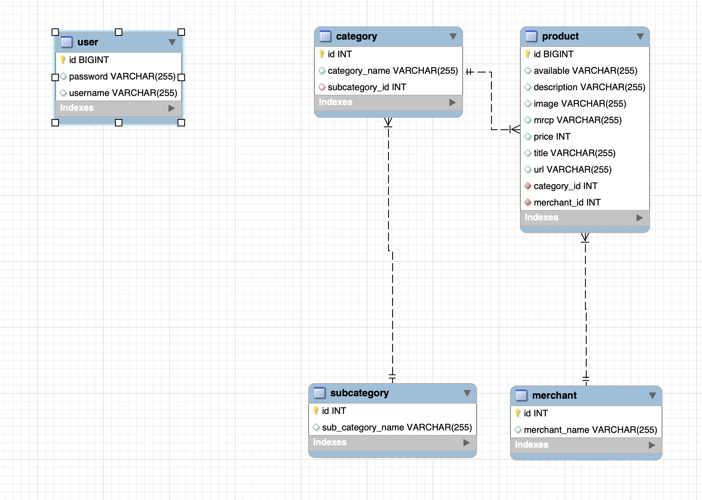
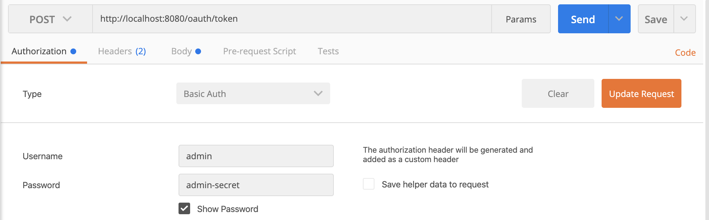

Create a Spring Boot application using https://start.spring.io (Spring Initializer) 
by chosing dependencies as Spring Web,Data,security and oauth2 

In this app we used mysql database for demo purpose. 

Application.properties

```
spring.datasource.url=jdbc:mysql://localhost:3306/mydb?useSSL=false
spring.datasource.username=temp
spring.datasource.password=root
spring.datasource.driver-class-name=com.mysql.jdbc.Driver
spring.jpa.show-sql=true
spring.jpa.properties.hibernate.dialect=org.hibernate.dialect.MySQL5Dialect
spring.jpa.hibernate.ddl-auto=create
spring.jpa.generate-ddl=true
```

###### Database structure




the following actions are implemented
  * Create new product
  *	Search a product by product name
  *	Edit a product
  *	Delete product(s)
  
######  implemented Oauth2 authentication for this app

use postman to send a request for token http://localhost:8080/oauth/token please see images below

  
 
 you will receive token like below
 
 

send the get,post,put,delete requests by adding the token in url like below.

 


